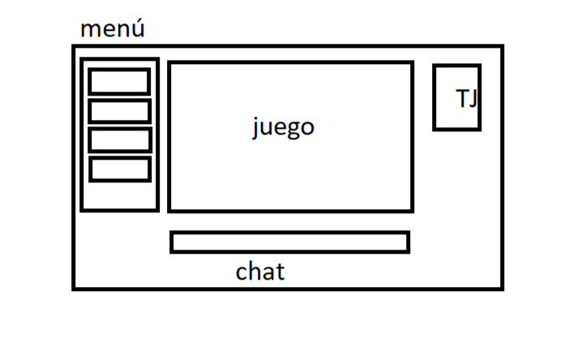

# ¿Quién es Quién?

- [Introduccion](#introduccion)
- [Manual](#manual)
- [Metodologia](#metodologia)
- [Descripcion técnica](#descripcion-tecnica)
- [Diseño](diseño)
- [Implementación](#implementacion)
- [Pruebas](#pruebas)
- [Análisis del tiempo invertido](#analisis-del-tiempo-invertido)
- [Conclusiones](#conclusiones)

## Introducción
Este proyecto ha sido creado por [<ins>Alejando Villar Rioja</ins>](https://github.com/KanekiiKat) y [<ins>Pablo González Temes</ins>](https://github.com/Pistacho14) dos alumnos de 1º de DAM del centro [<ins>IES de Teis</ins>](http://www.edu.xunta.gal/centros/iesteis/). Se trata de un "*¿Quién es Quién?*" un juego de mesa tradicional que trata de adivinar un personaje, el cual se elige aleatoriamente, y el jugador debe adivinarlo preguntando sobre las características faciales del elegido. En cualquier momento, el usuario puede tratar de adivinar el personaje, aunque aun tenga dudas sobre cual es el correcto. Si lo acierta se considerará como una victoria, mientras que en el caso contrario será una derrota.

## Manual

### Requisitos
Los requisitos para el funcionamiento son:
- [<ins>Pip</ins>](https://pypi.org/project/pip/)
- [<ins>Git</ins>](https://git-scm.com)
- [<ins>Python</ins>](https://www.python.org)
- [<ins>Venv</ins>](https://docs.python.org/es/3.8/library/venv.html)
- [<ins>Reflex</ins>](https://reflex.dev)

### Instalación
---
Para instalar los requerimientos sigue los siguientes pasos.

Clonar el repositorio de github.

` git clone https://github.com/Pistacho14/quien-es-quien.git`

Crear y activar un entorno virtual con *venv* (Si no está instalado, se puede ver como se instala en el apartado de [instalacion de requerimientos manualmente](#instalacion-de-requerimientos-manualmente), tanto en  Windows como en Linux).

`python -m venv nombre_del_entorno`

**Windows:** 

`> .\.venv\Scripts\activate`

**Linux:**

`$ source nombre_del_entorno/bin/activate`

Para instalar los requerimientos manualmente ponemos el siguiente comando. 

`pip install -r requeriments.txt`

Si hay errores en la instalación, puedes seguir los siguientes pasos para instalarlo de forma manual.

### Instalacion de requerimientos manualmente
---
#### Windows

Para instalar Python puedes instalarlo desde la web de [<ins>*Python*</ins>](https://www.python.org/downloads/) y seguir los pasos de la instalación.

Para instalar [<ins>Pip</ins>](https://pypi.org/project/pip/) ejecutamos el siguiente comando `> python get-pip.py`

Para instalar [<ins>Git</ins>](https://git-scm.com) se puede instalar siguiendo la documentación oficial [<ins>aquí</ins>](https://git-scm.com/downloads/win).

Para instalar [<ins>*Venv*</ins>](https://docs.python.org/es/3.8/library/venv.html), se puede serguir su documentación oficial [<ins>aquí</ins>](https://docs.python.org/es/3.8/library/venv.html).

---
#### Linux

Para instalar *Python* en Linux se puede hacer con el siguiente comando.

`$ sudo apt install python3`

Para instalar *venv* en Linux se puede instalar con el siguiente comando.

`$ sudo apt install python3-venv`

---
Una vez instalados los requisitos creamos un archivo para la aplicación.

` git clone git@github.com:<tuusuario>/tuproyecto.git`

Una vez clonado, creamos el entorno virtual con el siguiente comando:

`python3 -m venv nombre_del_entorno`

**Windows:** 

`> .\.venv\Scripts\activate`

**Linux:** 

`$ source nombre_del_entorno/bin/activate`

(Cuando quieras desactivar *venv*, simplemente pon `deactivate` en la terminal)

Una vez activado el *venv*, instalamos el [<ins>Reflex</ins>](https://reflex.dev) con el comando.

`pip install reflex` 

Una vez instalado todo, inicializamos *Reflex*.

`reflex run`

## Uso
El usuario debe introducir la característica del personaje en la caja de texto y posteriormente pulsar la tecla "Enter" o el botón "Enviar" en la interfaz. Una vez quiera tratar de adivinar el personaje elegido, el jugador deberá teclear el nombre en cuestión para comprobar el resultado.

## Metodologia
A la hora de afontar la lógica, tratamos de utilizar TDD (Test Driven Development) en los casos que pudimos, con la idea de que cada funcion nueva que se implementa pase una serie de casos test, para minimizar los errores en el código. A la hora de la ejecución implementar esta técnica resultó todo un desafío debido a nuestra inexperiencia a la hora de trabajar en un proyecto real.

Inicialmente nos planteamos trabajar con una metodología prototipada, tratándo de crear una version extremadamente básica del software para poco a poco ir mejorando parte de la misma hasta conseguir el producto ya terminado. Pero a medida que hicimos las primeras *dailies*, ante el temor de no ir por buen camino debido a la inexperiencia, nos decantamos por una metodología en espiral, que era la recomendada en clase.

Para finalizar, el marco de trabajo utilizado ha sido Kanban.

## Descripcion técnica

### Diagrama de casos de uso

### Arquitectura de la aplicación

### Posibles tecnologías
| Testing GUI        |
| ------------- |
| [<ins>Selenium</ins>](https://www.selenium.dev/)      |
| [<ins>Axiom.ai</ins>](https://axiom.ai/automate/web-ui-testing)      |

Creemos que un testing mas exhaustivo de la interfaz habría aportado mucho a la hora de evitar errores, por lo tanto pensamos en estas dos, que se especializan en eso.

## Diseño
En las primeras reuniones del equipo, nos decantamos por una distribución como la mostrada en la imagen de abajo. Esta idea surgió a raiz de que creimos que era obligatorio implementar la posibilidad de guardar partida y por tanto diseñamos la GUI con esa idea en mente.

En la versión 1.0 se optó por un diseño mas simple, eliminando el menú y sustituyéndolo por un botón de reiniciar. De todas formas tenemos pensado implementar un menú con diferentes funcionalidades, entre ellos el log de características preguntadas.

Sobre las dependencias, este sería el diagrama en cuestión:

## Implementación

En este proyecto se ha usado:

- [Python](https://www.python.org)
    - [Pytest](https://docs.pytest.org/en/stable/#) - Utilizado para hacer los casos test.
    - [Pydeps](https://pypi.org/project/pydeps/) - Usado para importar de forma rapida las dependencias en el archivo de requirements.txt.
- [Reflex](https://reflex.dev)
    - CSS - Utilizado para interpretar los estilos del frontend utilizando un enfoque basado en CSS.
    - XML - Usado para estructurar el frontend empleando una sintaxis inspirada en XML.
- [Git](https://git-scm.com)
- [Markdown](https://markdown.es)

## Pruebas

## Análisis del tiempo invertido
Al momento de estar escribiendo este documento (18:50 - 11/12/2024) Este es el tiempo que hemos invertido en el código del proyecto.

En total suman alrededor de 70 horas puramente de estar escribiendo (o borrando) código. Cuando empezamos el proyecto quisimos distribuir bien el tiempo, para evitar la sensación de burnout que tan común es en los equipos de desarrollo. Nos decidimos a hacer jornadas de 18:00 - 22:00/23:00 a mayores de las horas de programación de las que disponíamos en clase (cerca de 2.5h de media al dia) desde el día 25 de Noviembre (aunque previamente invirtiéramos tiempo desarrollando otra aplicación que sirvió como formación). 

Al ver a pocos días de la deadline que aun quedaba por hacer mas de lo que podríamos hacer en ese horario, decidimos aumentar las horas de trabajo. Con todo esto, las horas totales invertidas en el proyecto sumarían 109 horas.

## Posibles mejoras
Tenemos pensado implementar el menú que originalmente conceptualizamos. Adicionalmente nos gustaría mejorar el estilo de la página o añadir la posibilidad de personalización de la web por parte del usuario. También queremos añadir un sistema de puntuación o turnos para mejorar el feedback al ganar. Por último, relacionado con el sistema de turnos, si se termina por implementar, habíamos conceptualizado un "modo dificil".

## Conclusiones y agradecimientos

Este proyecto ha sido un buen primer choque de realidad con el mundo de la programación. Cuando empezamos pensamos que tendríamos terminado el proyecto en una semana, como mucho una y media. Cada vez que creíamos ir por buen camino nos chocábamos con otro componente de reflex que no funcionaba (o mas bien no lo hacíamos funcionar). Sin contar con buscar información de los mismo comandos cinco o diez veces (tirando por lo bajo), las dificultades de trabajar en equipo, cambios de rumbo de ultima hora o malentendidos.
Aun con todo esto ha sido una gran experiencia, hemos aprendido mas en tres semanas que en tres meses. Y la satisfacción de ver como funciona todo "a la perfección" no tiene precio.

Para terminar este bloque queríamos agradecer a los otros compañeros que estuvieron ahí para apoyarnos:

- [Rubi Quintas Alonso](https://github.com/UnTalRubi)
- [M. Marcelo S. Salgado](https://github.com/MMSS99)
- [MiguelRQ24](https://github.com/MiguelRQ24)
- [Gabrielgsd](https://github.com/GabrielgsdCIUwU)
- [Bardia Rajabi Rajabi](https://github.com/Valwraek)

